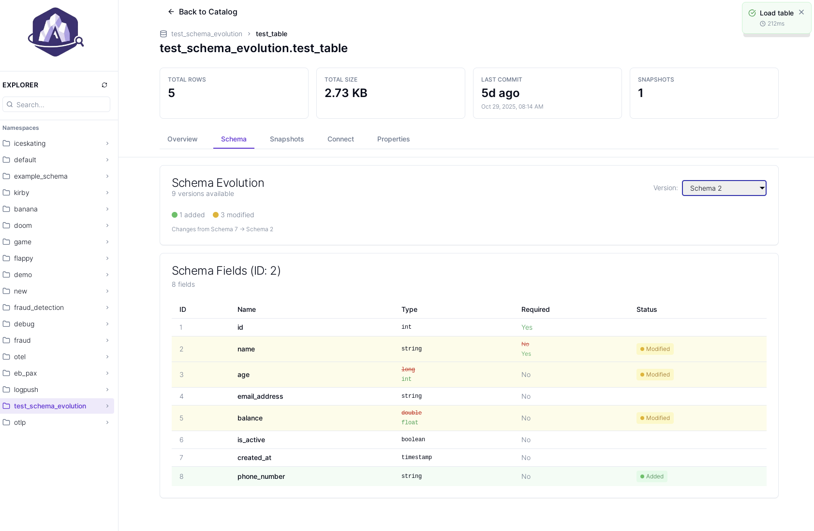

<p align="center">
  
</p>

<p align="center">
  <a href="https://opensource.org/licenses/MIT"></a>
  <a href="https://workers.cloudflare.com/"></a>
  <a href="https://claude.com/claude-code"></a>
  <a href="https://react.dev/"></a>
  <a href="https://www.typescriptlang.org/"></a>
</p>

<p align="center">
  I couldn't find a simple Apache Iceberg REST catalog browser to help me do some debugging so I decided to sip a little Scotch and spend a night with my good friend Claude making one. While this web app is relatively secure, it can also easily be run locally. 

  I do not have access to all different Apache Iceberg REST catalog services so please feel free to test yours and file an issue if you run into problems.
</p>

<p align="center">
  <strong>Check it out:</strong> <a href="https://iceberg.rest">iceberg.rest</a>
</p>

<p align="center">
  
</p>

---

## Features

### Core Functionality
- **Supports various auth mechanisms**: Bearer Token, OAuth2, AWS SigV4
- **Catalog browser**: Hierarchical namespace and table navigation
- **Table Stats**: Schema, snapshots, partitions, properties
- **Schema Evolution**: Visual diff viewer with change highlighting
- **Snapshot History**: 7-day activity charts and detailed metadata
- **Connection Examples**: Pre-filled code for DuckDB, Apache Trino, Spark, PyIceberg, and Snowflake

### Security & Privacy
- **AES-256-GCM Encryption**: All credentials encrypted at rest
- **Read-Only**: We never modify data or metadata
- **No Parquet Access**: Only reads catalog metadata via REST API (we only call /config, /namespaces, /tables)
- **Session Management**: 24-hour TTL of encrypted keys with instant cleanup when you hit "logout"

### Tested Catalogs
- Cloudflare R2 Data Catalog (Bearer)
- Databricks Unity Catalog (Bearer)
- AWS Glue Data Catalog (SigV4)
- Snowflake Open Catalog (OAuth)
- Apache Polaris (OAuth)
- Microsoft OneLake (Bearer)

Should work with...
- Any Apache Iceberg REST-compliant catalog (if it doesn't, let me know)

## Quick Start

### Prerequisites
- Node.js 18+
- A Cloudflare account (for deployment)
- An Iceberg REST catalog endpoint

### Local Development

1. **Install dependencies**
   ```bash
   npm install
   ```

2. **Authenticate with Cloudflare**
   ```bash
   npx wrangler login
   ```

3. **Set up local database**
   ```bash
   npx wrangler d1 execute iceberg_sessions --local --file=schema.sql
   ```

4. **Run development servers** (in separate terminals)
   ```bash
   # Terminal 1: Cloudflare Worker (API proxy)
   npx wrangler dev --port 8787

   # Terminal 2: Vite dev server
   npm run dev
   ```

5. **Visit** [http://localhost:5173](http://localhost:5173)

### Why Two Servers?
- **Vite** (`localhost:5173`): Fast HMR for frontend development
- **Worker** (`localhost:8787`): Handles authentication, CORS proxying, and database access
- Vite proxies API requests to the Worker (configured in `vite.config.ts`)

## Production Deployment

### 1. Configure wrangler.toml

Copy the example configuration file:
```bash
cp wrangler.toml.example wrangler.toml
```

### 2. Create Cloudflare Resources

```bash
# Create D1 database
npx wrangler d1 create iceberg_sessions

# Create KV namespace
npx wrangler kv:namespace create "TOKENS"
```

Copy the generated IDs from the output.

### 3. Update wrangler.toml

Update these values in `wrangler.toml` with the IDs from step 2:

```toml
[[d1_databases]]
binding = "DB"
database_name = "iceberg_sessions"
database_id = "YOUR_DATABASE_ID"  # Replace with your D1 database ID

[[kv_namespaces]]
binding = "TOKENS"
id = "YOUR_KV_ID"  # Replace with your KV namespace ID
```

### 4. Initialize Database

**For new deployments:**
```bash
npx wrangler d1 execute iceberg_sessions --remote --file=schema.sql
```

**For existing deployments** (if you already have a database with the old schema):
```bash
npx wrangler d1 execute iceberg_sessions --remote --file=migration-auth-types-clean.sql
```

### 5. Deploy

```bash
# Build and deploy
npm run build
npx wrangler deploy
```

Your app will be live at `https://iceberg-rest.<your-subdomain>.workers.dev`

You can always add a custom domain later. 

## Project Structure

```
src/
├── components/
│   ├── auth/          # Login, authentication UI
│   ├── catalog/       # Namespace browser, table list
│   ├── table/         # Schema, snapshots, partitions tabs
│   ├── layout/        # Sidebar, navigation
│   └── ui/            # Reusable components (Button, Card, Badge, etc.)
├── lib/
│   ├── iceberg/       # Iceberg REST API client
│   ├── crypto/        # AES-256-GCM encryption
│   └── utils/         # Helper functions
├── pages/             # Route pages (Login, Catalog, Table)
└── types/             # TypeScript definitions

worker/
└── index.ts           # Cloudflare Worker (auth, proxying, analytics)
```

## Database Schema

The app uses Cloudflare D1 (SQLite) with three tables:

- **sessions**: Encrypted credentials, session metadata
- **analytics**: Page views, API calls, response times (no PII)
- **catalog_usage**: API call metrics (response times, success rates)

**WE DO NOT COLLECT OR STORE:**
- Namespace names
- Table names 
- Table stats 
- Schemas
- Any of the contents of your snapshot files

You can see exactly what is collected via the schema.sql file. Note, the only thing stored in the metadata field is the root domain (IE cloudflare.com, databricks.com, etc) so I can track which catalogs are failing to auth for bug fixing. 

See `schema.sql` for the complete schema.

## Technology Stack

- **Frontend**: React 18, TypeScript, Vite, Tailwind CSS
- **Backend**: Cloudflare Workers (serverless)
- **Database**: Cloudflare D1 (SQLite)
- **Storage**: Cloudflare KV (encrypted credentials)
- **Icons**: Lucide React
- **Routing**: React Router v6

## Documentation

- **[CLAUDE.md](CLAUDE.md)**: Guide for building with Claude Code in case you want to roll your own
- **[MULTI-AUTH-GUIDE.md](MULTI-AUTH-GUIDE.md)**: Multi-authentication implementation details
- **[schema.sql](schema.sql)**: Database schema (use this for new deployments)
- **[migration-auth-types-clean.sql](migration-auth-types-clean.sql)**: Database migration (only for existing deployments upgrading from old schema)

## Contributing

This project welcomes contributions! Feel free to:
- Report bugs or request features via [GitHub Issues](https://github.com/yourusername/iceberg.rest/issues)
- Submit pull requests
- Share feedback
- Add support for new catalog types

## License

MIT

## Acknowledgments

This project was built with [Claude Code](https://claude.com/claude-code). See [CLAUDE.md](CLAUDE.md) for details on the development process.

## Trademark Notice

This project is not affiliated with or endorsed by the Apache Software Foundation.

Apache®, Apache Iceberg™, Iceberg™, and the Apache feather logo are trademarks of The Apache Software Foundation.
